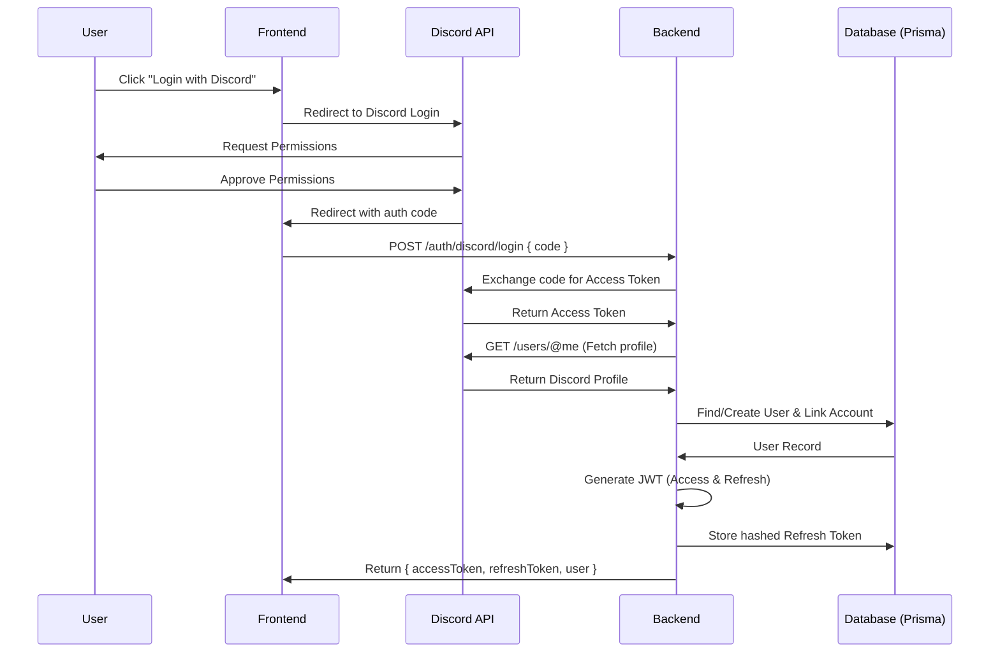

# Auth & Users Architecture Plan (Revised)

This document outlines the architectural plan for implementing authentication and user management in the UG Arena backend.

## 1. Discord Authentication Data Flow

The authentication process follows a frontend-initiated OAuth2 flow:



## 2. Key Architecture Corrections

Based on NestJS best practices and security requirements:

- **Session Invalidation**: While using stateless JWTs for access, the **Refresh Token** hash will be stored in the database. This allows the backend to revoke access (e.g., on logout or security breach) while maintaining the benefits of JWTs.
- **Global Prisma Module**: A `PrismaModule` will be created to manage the database connection lifecycle globally, preventing multiple connection pools.
- **Standardized Structure**: `main.ts` and `app.module.ts` will be moved into `src/` to align with the `nest-cli.json` configuration and standard NestJS project layouts.
- **Global Validation**: A `ValidationPipe` will be enabled in `main.ts` to enforce DTO constraints automatically.

## 3. Prisma Schema Updates

The following modifications to `prisma/schema.prisma` are required:

- **User Model**:
  - Make `password` optional (allow `@default("")` or null for OAuth users).
  - Add `refreshTokenHash String?` for secure session management.

### Proposed Changes

```prisma
model User {
  // ... existing fields
  password                String?                  // Made optional for OAuth users
  refreshTokenHash        String?                  // Added for session management
  // ... rest of the model
}
```

## 4. Implementation Checklist

### Phase 0: Project Setup

- Move `main.ts` and `app.module.ts` to `src/`.
- Update `package.json` and `nest-cli.json` if necessary to reflect structure changes.
- Install dependencies: `@nestjs/jwt`, `@nestjs/passport`, `passport`, `passport-jwt`, `axios`, `bcrypt`, `class-validator`, `class-transformer`.

### Phase 1: Foundation & Prisma

- Create `src/prisma/prisma.module.ts` and `src/prisma/prisma.service.ts`.
- Update `prisma/schema.prisma` with `password?` and `refreshTokenHash`.
- Run `npx prisma migrate dev --name add_auth_fields`.
- Create `src/common` directory for decorators, guards, and filters.

### Phase 2: Users Module

- Create `src/users/users.module.ts`.
- Create `src/users/users.service.ts` (CRUD, findByEmail, updateRefreshToken).
- Create `src/users/users.controller.ts` (GET `/users/me`).

### Phase 3: Auth Module (JWT & Discord)

- Create `src/auth/auth.module.ts`.
- Create `src/auth/dto/login-discord.dto.ts`.
- Create `src/auth/auth.controller.ts`:
  - `POST /auth/discord/login`: Receives code, exchanges it, returns tokens.
  - `POST /auth/refresh`: Validates refresh token, returns new pair.
  - `POST /auth/logout`: Clears `refreshTokenHash` in DB.
- Create `src/auth/auth.service.ts`:
  - Discord API integration logic.
  - Token generation (JWT) and hashing (bcrypt).
- Create `src/auth/strategies/jwt.strategy.ts`.

### Phase 4: Authorization (RBAC)

- Create `src/common/decorators/roles.decorator.ts`.
- Create `src/common/guards/jwt-auth.guard.ts`.
- Create `src/common/guards/roles.guard.ts`.

### Phase 5: Global Configuration

- Update `app.module.ts` to import `AuthModule`, `UsersModule`, and `PrismaModule`.
- Configure `main.ts` with `ValidationPipe` and CORS.

## 5. Required Environment Variables

```env
# Discord Configuration
DISCORD_CLIENT_ID=
DISCORD_CLIENT_SECRET=
DISCORD_REDIRECT_URI=

# JWT Configuration
JWT_ACCESS_SECRET=
JWT_REFRESH_SECRET=
JWT_ACCESS_EXPIRATION=15m
JWT_REFRESH_EXPIRATION=7d
```

---

**HALT: Please review and approve this plan before moving to code generation.**
